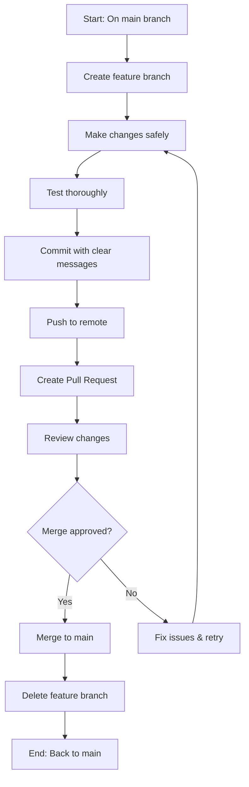

# 🤖 Git Feature Branch Workflow Guide for AI Agents

This guide documents the **safe Git workflow** implemented for the Oracle VPS signup project, specifically designed for AI agentic coding to prevent irreversible changes and ensure maximum safety.

## 🎯 Objective

Enable **fastest, easiest AI agentic coding** with **maximum safety** from irreversible changes by using feature branches with pull requests while keeping main branch protection.

## 🏗️ Workflow Overview



## 🔒 Safety Features

### Main Branch Protection
- ✅ **Direct commits to main are BLOCKED**
- ✅ **Pull requests required for all changes**
- ✅ **Branch protection rules enforced**
- ✅ **No accidental main branch damage possible**

### Feature Branch Safety
- ✅ **All development happens on isolated branches**
- ✅ **Changes don't affect main until approved**
- ✅ **Easy rollback if issues arise**
- ✅ **Clear separation of concerns**

## 🚀 Step-by-Step AI Workflow

### 1. Create Feature Branch
```bash
# Always branch from main for new work
git checkout -b feature/your-feature-name

# Verify you're on the new branch
git branch
```

**AI Best Practice**: Use descriptive branch names that explain the feature or fix.

### 2. Make Changes Safely
```bash
# Make your changes - they only affect this branch
# Edit files, add features, fix bugs
# Test everything thoroughly

# Check what you've changed
git status
git diff
```

**AI Best Practice**: 
- Start with small, focused changes
- Test each change before proceeding
- Keep commits atomic and logical

### 3. Commit with Clear Messages
```bash
# Stage your changes
git add .

# Commit with descriptive message
git commit -m "feat: add new feature description

- Add feature X with Y functionality
- Include proper error handling
- Add tests for new functionality
- Update documentation"

# Or for smaller changes:
git commit -m "docs: improve README with clearer examples"
```

**AI Best Practice**: 
- Use conventional commit format: `type: description`
- Include what, why, and how in the message
- Keep first line under 50 characters

### 4. Push to Remote
```bash
# Push your feature branch
git push -u origin feature/your-feature-name

# GitHub will provide a pull request URL automatically
```

### 5. Create Pull Request
Visit the URL GitHub provides, or go to your repository on GitHub:

1. Click **"Pull requests"** tab
2. Click **"New pull request"**
3. Select your feature branch as the compare branch
4. **Fill out the pull request template:**
   - **Title**: Clear description of changes
   - **Description**: What, why, and how of the changes
   - **Reviewers**: Add reviewers if available
   - **Labels**: Add relevant labels

### 6. Review Process
```bash
# While waiting for review, you can continue working
# If changes are requested:

# Make additional commits to the same branch
git add .
git commit -m "fix: address review feedback"
git push

# The pull request will automatically update
```

### 7. Merge After Approval
Once approved:
1. Click **"Merge pull request"** on GitHub
2. Choose merge method (usually "Squash and merge")
3. **Delete the feature branch** when prompted

### 8. Clean Up
```bash
# Switch back to main and pull latest changes
git checkout main
git pull origin main

# Delete the local feature branch
git branch -d feature/your-feature-name
```

## 🛡️ Protection Rules

### ✅ Encouraged Practices
- Feature branches for ALL changes
- Small, incremental commits
- Clear, descriptive commit messages
- Thorough testing before pushing
- Self-review even without human reviewers

### ❌ Blocked Practices  
- Direct commits to main branch
- Large, risky changes without review
- Skipping pull request process
- Working directly on main branch

## 💡 AI-Specific Best Practices

### For Maximum Safety
1. **Start Small**: Begin with documentation or minor improvements
2. **Test Thoroughly**: Verify changes work before committing
3. **Atomic Commits**: One logical change per commit
4. **Clear Messages**: Help future AI agents understand changes
5. **Self-Review**: Even without human reviewers, review your own PR

### For Fast Development
1. **Branch Naming**: Use clear, descriptive names
   - `feature/github-actions-ci`
   - `fix/instance-creation-error`
   - `docs/readme-improvements`
   - `enhancement/notification-system`

2. **Commit Messages**: Use conventional format
   - `feat:` for new features
   - `fix:` for bug fixes
   - `docs:` for documentation
   - `refactor:` for code restructuring
   - `test:` for adding tests

3. **Pull Request Templates**: Always include
   - What was changed
   - Why it was needed
   - How it was implemented
   - Testing performed

### Emergency Procedures
If something goes wrong:
```bash
# Discard changes on feature branch
git checkout .
git clean -fd

# Reset to last commit on branch
git reset --hard HEAD

# Or start over with new branch
git checkout main
git branch -d broken-branch-name
git checkout -b new-feature-branch
```

## 🎯 Current Demonstration

This workflow is currently demonstrated with:
- **Feature Branch**: `github-actions-enhancement`
- **Changes Made**: Added Git workflow documentation to README.md
- **Pull Request**: Available at provided GitHub URL
- **Status**: Ready for review and merge

## 🔄 Future AI Development

For all future AI agent work on this project:

1. **Always start from main**: `git checkout main && git pull origin main`
2. **Create feature branch**: `git checkout -b feature/description`
3. **Make changes safely**: All work on feature branch
4. **Follow commit conventions**: Clear, descriptive messages
5. **Create pull request**: Never merge directly to main
6. **Wait for review**: Even self-review for AI agents
7. **Merge after approval**: Only then delete feature branch

This workflow ensures **maximum safety** while enabling **fast, efficient AI development** without risk of damaging the main codebase.

---

*Last updated: 2026-01-01*
*Workflow: Feature Branch with Pull Request protection*